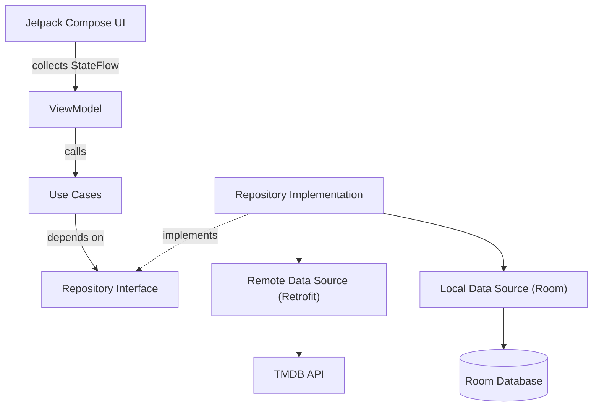
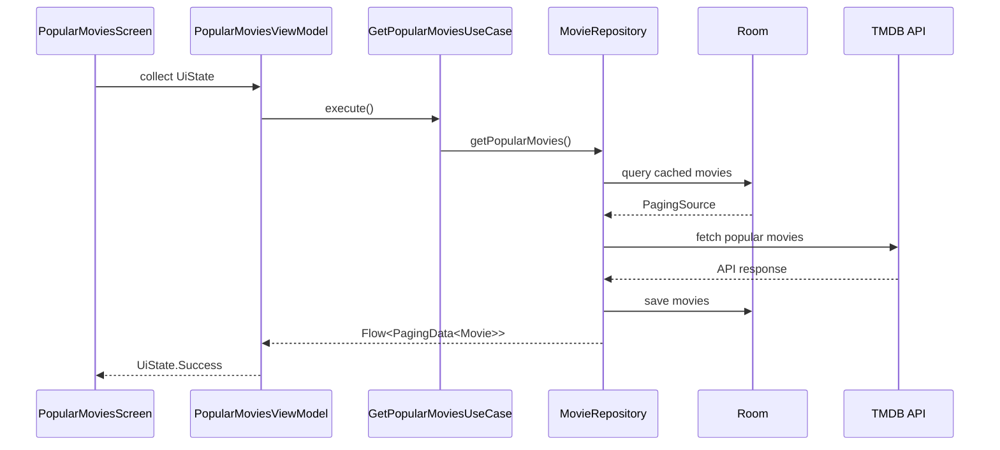
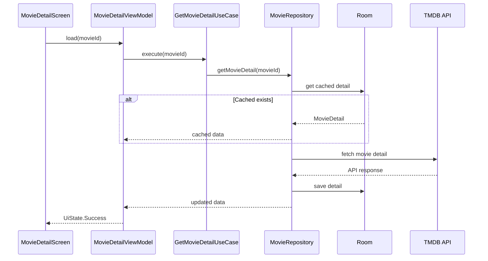
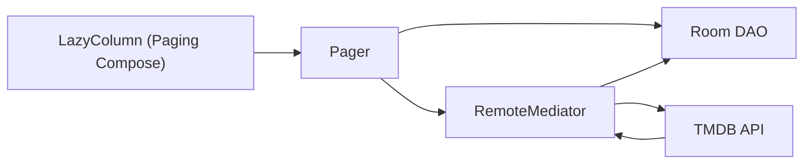
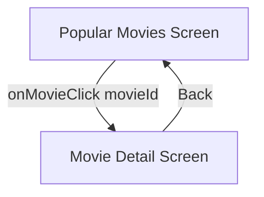

# 🎬 TMDB Android App  
### Jetpack Compose + Clean Architecture
A modern Android application that displays **popular movies** and **movie details** using the **TMDB API**.

Built with **Jetpack Compose**, **Clean Architecture**, **MVVM**, **Hilt**, **Paging 3**, and **Room**.

## 🧱 Tech Stack

- **Language:** Kotlin  
- **UI:** Jetpack Compose (Material 3)  
- **Architecture:** Clean Architecture + MVVM  
- **Dependency Injection:** Hilt  
- **Networking:** Retrofit + OkHttp  
- **Asynchronous:** Kotlin Coroutines + Flow  
- **Pagination:** Paging 3  
- **Local Cache:** Room  
- **Navigation:** Navigation Compose  
- **Image Loading:** Coil  

## 📐 Architecture Overview

This project follows **Android’s recommended app architecture** with a strict separation of concerns.

### 🏗 Layers

#### 🖥 UI Layer
- Jetpack Compose Screens  
- ViewModels  

#### 🧠 Domain Layer
- Business Logic  
- UseCases  
- Domain Models  
- Repository Interfaces  

#### 💾 Data Layer
- Retrofit API Services  
- Room Database  
- Repository Implementations  

> 🗂 **Note:** Room acts as the **Single Source of Truth (SSOT)** in this application.

#### 🚀 Features

- Browse Popular Movies  
- View Movie Details  
- Offline Caching  
- Pagination Support  
- Modern Material 3 UI  
- Clean & Scalable Architecture  

---

## 🏗 High-Level Architecture Diagram  
#### (Clean Architecture + MVVM)

---

## 🔄 Detailed Data Flow
#### 📃 Popular Movies List

#### 🎞 Movie Details Screen

---

### 📦 Pagination + Caching Flow  
#### (Paging 3 + Room + RemoteMediator)

#### ✅ Why this matters

- Room is always the **Single Source of Truth**
- Network only updates the database
- Offline support works automatically
- Paging is seamless and scalable

---

### 🧭 Navigation Flow

---

### 📸 Screenshots

_Yet to add screenshots here_

---

### 📄 License

This project is for educational purposes.

