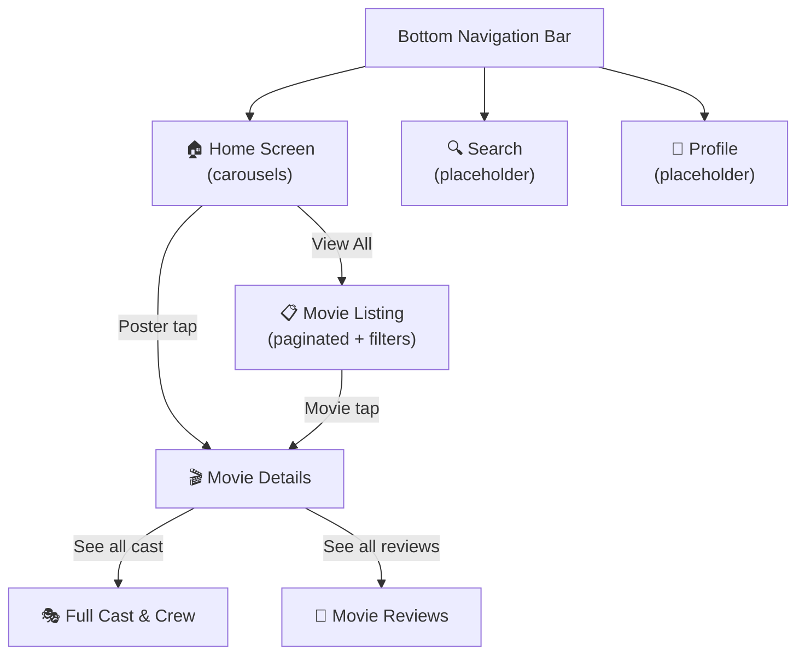
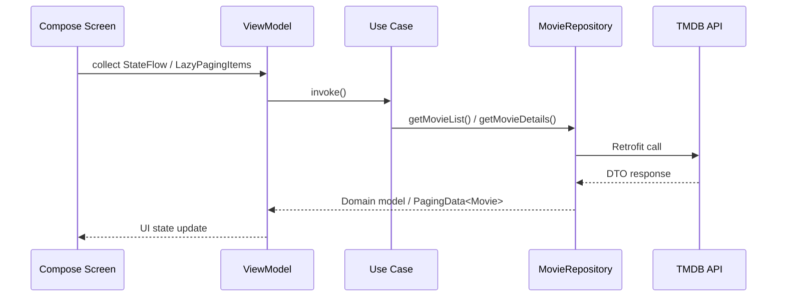

# 🎬 TMDB Android App [version 1]
### Jetpack Compose · Clean Architecture · style Dark Theme


A modern Android application that browses movies using the **TMDB API** — featuring a home screen with carousels, paginated movie lists with filtering & sorting, detailed movie info, cast & crew, and reviews.

---

## ✨ Features

- **Home screen** — three horizontal carousels (Popular, Now Playing, Upcoming) loading in parallel, with a collapsible TopAppBar on scroll
- **Movie Listing** — paginated list for any TMDB list type; filter by genre, minimum rating, and release year; sort by popularity, rating, release date, or vote count
- **Movie Details** — backdrop, genres, runtime, tagline, overview, rating, and a latest review preview
- **Full Cast & Crew** — complete credits with profile images
- **Movie Reviews** — paginated review list with author avatars and ratings
- **Bottom navigation** — Home / Search / Profile tabs; auto-hidden on detail screens
- **Netflix-inspired dark theme** — permanent dark colour scheme with Netflix Red accents and a bold type scale

---

## 🧱 Tech Stack

| Layer            | Libraries                         |
|------------------|-----------------------------------|
| **UI**           | Jetpack Compose, Material 3, Coil |
| **Navigation**   | Navigation Compose                |
| **Architecture** | Clean Architecture + MVVM         |
| **DI**           | Hilt                              |
| **Networking**   | Retrofit 3, OkHttp, Gson          |
| **Async**        | Kotlin Coroutines + Flow          |
| **Pagination**   | Paging 3                          |
| **Language**     | Kotlin 2.3                        |

---

## 📐 Architecture

```
Presentation  →  Domain  ←  Data
```

- **Presentation** — Compose screens + `@HiltViewModel` ViewModels. Non-paginated screens expose `data class` UI state (isLoading / error / data) via `StateFlow`; paginated screens collect `PagingData` directly with `collectAsLazyPagingItems()`.
- **Domain** — Use cases (invoked via `operator fun invoke()`), repository interfaces, domain models, and a `Result<T>` / `safeCall {}` utility.
- **Data** — `MovieRepositoryImpl` backed by Retrofit. DTOs are mapped to domain models in `MovieMapper.kt`. Paging is handled by two `PagingSource` classes: `MovieListPagingSource` and `MovieReviewsPagingSource`.

### Filter → Endpoint routing

`MovieListPagingSource` automatically routes to the `discover/movie` endpoint whenever `MovieFilterState.needsDiscoverApi` is true (any genre, rating, year filter, or explicit sort is active). Otherwise it calls the natural list endpoint (`movie/popular`, `movie/now_playing`, etc.).

---

## 🧭 Navigation


```mermaid
flowchart TD
    Home["🏠 Home Screen\n(carousels)"]
    Listing["📋 Movie Listing\n(paginated + filters)"]
    Details["🎬 Movie Details"]
    Cast["🎭 Full Cast & Crew"]
    Reviews["💬 Movie Reviews"]
    Search["🔍 Search\n(placeholder)"]
    Profile["👤 Profile\n(placeholder)"]

    Home -->|View All| Listing
    Home -->|Poster tap| Details
    Listing -->|Movie tap| Details
    Details -->|See all cast| Cast
    Details -->|See all reviews| Reviews

    BottomNav["Bottom Navigation Bar"]
    BottomNav --> Home
    BottomNav --> Search
    BottomNav --> Profile
```

> The bottom navigation bar is **only visible** on the three top-level routes (Home, Search, Profile) and hides automatically on all detail screens.

---

## 🔄 Data Flow


```mermaid
sequenceDiagram
    participant UI as Compose Screen
    participant VM as ViewModel
    participant UC as Use Case
    participant Repo as MovieRepository
    participant API as TMDB API

    UI->>VM: collect StateFlow / LazyPagingItems
    VM->>UC: invoke()
    UC->>Repo: getMovieList() / getMovieDetails()
    Repo->>API: Retrofit call
    API-->>Repo: DTO response
    Repo-->>VM: Domain model / PagingData<Movie>
    VM-->>UI: UI state update
```

---

## 🚀 Getting Started

1. Clone the repository.
2. Get a free API **Read Access Token** from [themoviedb.org](https://www.themoviedb.org/settings/api).
3. Add it to `local.properties` (create the file if it doesn't exist):
   ```
   TMDB_API_TOKEN=your_read_access_token_here
   ```
4. Build and run:
   ```bash
   ./gradlew installDebug
   ```

---

## 📄 License

This project is for educational purposes.
