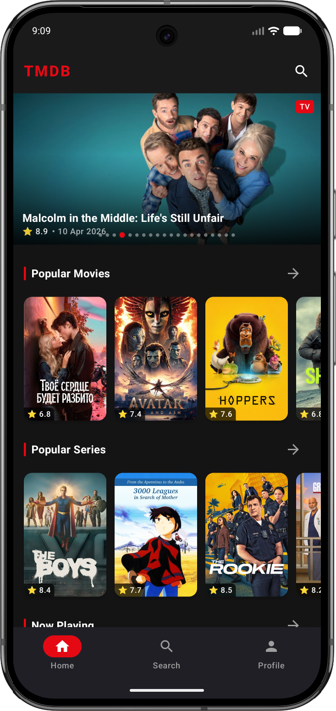
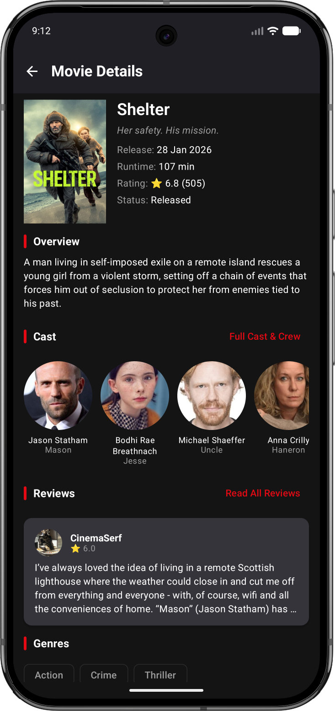
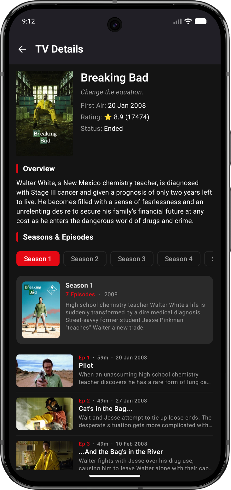
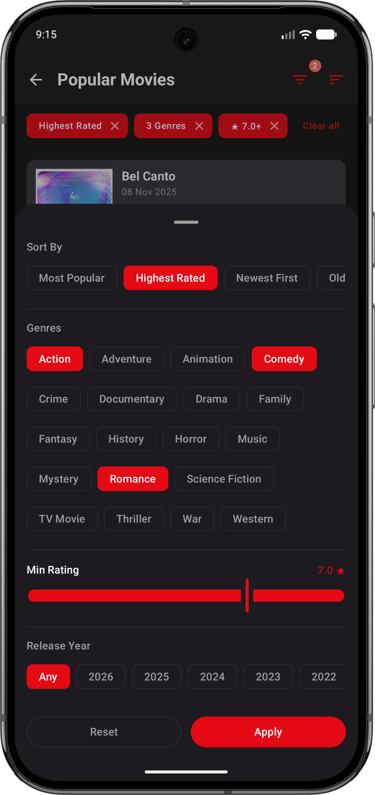
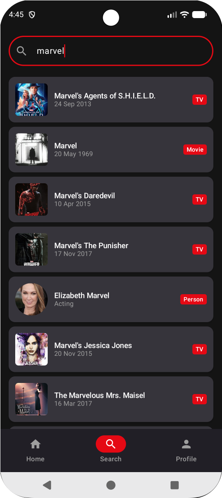
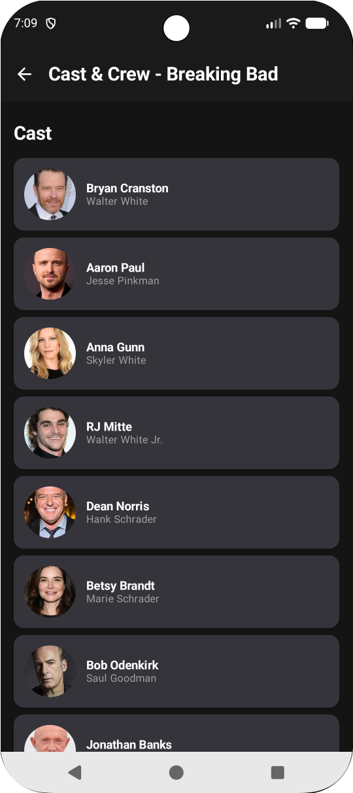
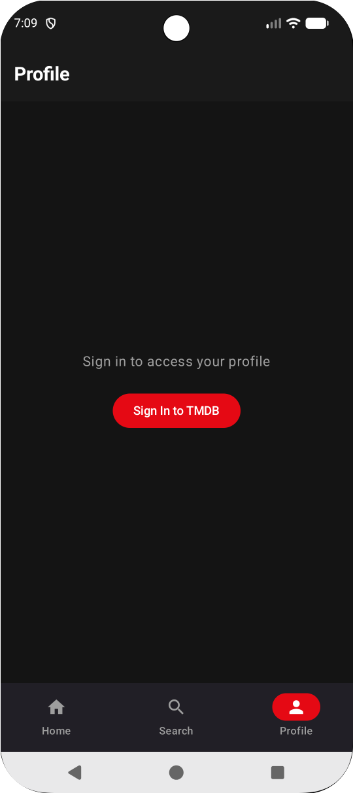
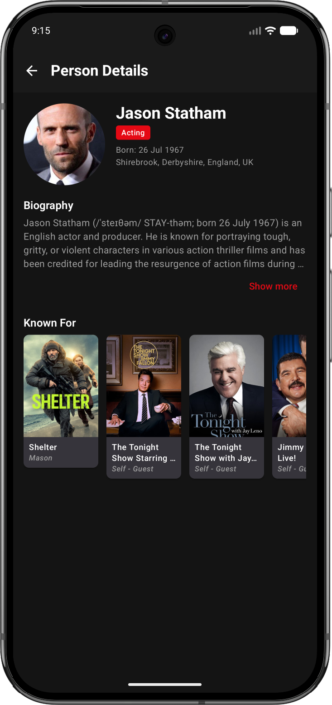
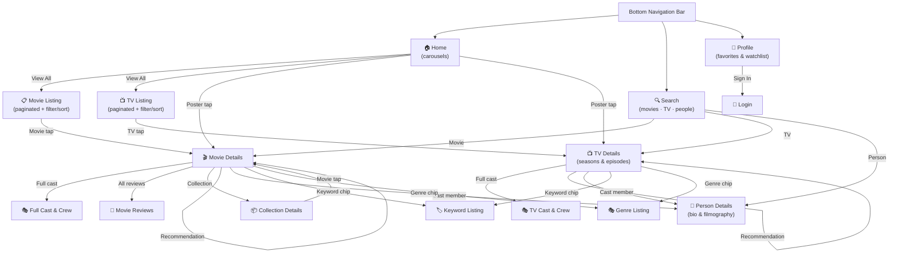
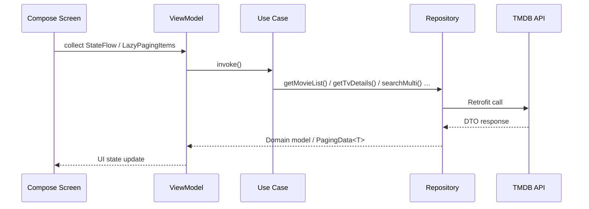

# 🎬 TMDB Android App
### Jetpack Compose · Clean Architecture · Material 3 · Dark Theme

A production-quality Android application for browsing movies and TV shows using the **TMDB API** — built to demonstrate modern Android development practices including Clean Architecture, Jetpack Compose, Paging 3, Hilt DI, and Kotlin Coroutines/Flow.

---

## 📸 Screenshots

<table>
  <tr>
    <td align="center"><b>Home</b></td>
    <td align="center"><b>Movie Details</b></td>
    <td align="center"><b>TV Details</b></td>
    <td align="center"><b>Filter & Sort</b></td>
  </tr>
  <tr>
    <td></td>
    <td></td>
    <td></td>
    <td></td>
  </tr>
  <tr>
    <td align="center"><b>Search</b></td>
    <td align="center"><b>Cast & Crew</b></td>
    <td align="center"><b>Profile</b></td>
    <td align="center"><b>Person Details</b></td>
  </tr>
  <tr>
    <td></td>
    <td></td>
    <td></td>
    <td></td>
  </tr>
</table>

---

## ✨ Features

- **Home** — six alternating carousels (Popular Movies, Popular TV, Now Playing, On The Air, Upcoming, Top Rated TV) loading in parallel with a collapsible TopAppBar on scroll
- **Movie & TV Listing** — paginated lists with full filter & sort bottom sheet (genre, minimum rating, release/air year, sort by popularity/rating/date/votes); filter state auto-routes to `discover` endpoint; active filters shown as chip strip below the app bar
- **Movie Details** — backdrop, genres (tappable → genre listing), tagline, overview, runtime, status, collection banner, cast carousel, review preview, YouTube videos carousel, tabbed image gallery (Backdrops / Posters), recommendations carousel, keywords (tappable → keyword listing), and external links (IMDb, Wikidata, social media)
- **TV Details** — same depth as movies plus season/episode browser with season selector chips and expandable episode list
- **Keyword Search** — tapping a keyword chip on any detail screen navigates to a listing pre-filtered by that keyword
- **Genre Search** — tapping a genre chip navigates to a listing pre-filtered by that genre
- **Full Cast & Crew** — complete credits with profile images
- **Movie Reviews** — paginated review list with author avatars and ratings
- **Person Details** — biography, profile image, and combined filmography (movies & TV)
- **Search** — debounced multi-type search across movies, TV shows, and people; media-type chip on each result
- **Account Login** — optional TMDB v3 account sign-in (no OAuth); Favorites and Watchlist tabs on the Profile screen
- **Bottom Navigation** — Home / Search / Profile tabs; auto-hidden on all detail screens
- **Dark Theme** — Netflix-inspired permanent dark colour scheme with red accents and a bold type scale

---

## 🧱 Tech Stack

| Layer | Libraries |
|---|---|
| **UI** | Jetpack Compose, Material 3, Coil |
| **Navigation** | Navigation Compose |
| **Architecture** | Clean Architecture + MVVM |
| **DI** | Hilt |
| **Networking** | Retrofit 3, OkHttp, Gson |
| **Async** | Kotlin Coroutines + Flow |
| **Pagination** | Paging 3 |
| **Local Storage** | SharedPreferences (session persistence) |
| **Language** | Kotlin 2.3 |

---

## 📐 Architecture

```
Presentation  →  Domain  ←  Data
```

- **Presentation** — Compose screens + `@HiltViewModel` ViewModels. Non-paginated screens expose `data class` UI state via `StateFlow`; paginated screens collect `PagingData` directly with `collectAsLazyPagingItems()`.
- **Domain** — Use cases (invoked via `operator fun invoke()`), repository interfaces, domain models, and a `Result<T>` / `safeCall {}` utility.
- **Data** — Five repository implementations (`Movie`, `Tv`, `Search`, `Auth`, `Account`) backed by Retrofit. DTOs mapped to domain models in `*Mapper.kt` files. Pagination handled by five `PagingSource` classes. `SessionManager` persists the TMDB session in `SharedPreferences`.

### Filter → Endpoint Routing

Both `MovieListPagingSource` and `TvListPagingSource` automatically route to the `discover` endpoint whenever their respective `FilterState.needsDiscoverApi` is true (any genre, rating, year filter, keyword, or non-default sort is active). Otherwise they call the natural list endpoints. `MovieListingViewModel` and `TvListingViewModel` use `flatMapLatest` on their filter state so the paging stream auto-restarts on every filter change.

---

## 🧭 Navigation


```mermaid
flowchart TD
    Home["🏠 Home\n(carousels)"]
    Listing["📋 Movie Listing\n(paginated + filter/sort)"]
    Details["🎬 Movie Details"]
    Cast["🎭 Full Cast & Crew"]
    Reviews["💬 Movie Reviews"]
    Collection["📦 Collection Details"]
    TvListing["📺 TV Listing\n(paginated + filter/sort)"]
    TvDetails["📺 TV Details\n(seasons & episodes)"]
    TvCast["🎭 TV Cast & Crew"]
    Search["🔍 Search\n(movies · TV · people)"]
    Profile["👤 Profile\n(favorites & watchlist)"]
    Login["🔑 Login"]
    Person["🧑 Person Details\n(bio & filmography)"]
    Keyword["🏷️ Keyword Listing"]
    Genre["🎭 Genre Listing"]

    Home -->|View All| Listing & TvListing
    Home -->|Poster tap| Details & TvDetails
    Listing -->|Movie tap| Details
    Details -->|Full cast| Cast
    Details -->|All reviews| Reviews
    Details -->|Collection| Collection
    Details -->|Recommendation| Details
    Details -->|Cast member| Person
    Details -->|Keyword chip| Keyword
    Details -->|Genre chip| Genre
    TvListing -->|TV tap| TvDetails
    TvDetails -->|Full cast| TvCast
    TvDetails -->|Recommendation| TvDetails
    TvDetails -->|Cast member| Person
    TvDetails -->|Keyword chip| Keyword
    TvDetails -->|Genre chip| Genre
    Collection -->|Movie tap| Details
    Search -->|Movie| Details
    Search -->|TV| TvDetails
    Search -->|Person| Person
    Profile -->|Sign In| Login

    BottomNav["Bottom Navigation Bar"]
    BottomNav --> Home & Search & Profile
```

> The bottom navigation bar is **only visible** on the three top-level routes (Home, Search, Profile) and hides automatically on all detail screens.

---

## 🔐 Auth Flow

Login uses the TMDB v3 session API — no OAuth redirect needed:

```
1. GET  authentication/token/new                        → request_token
2. POST authentication/token/validate_with_login        → validated token
3. POST authentication/session/new (token)              → session_id (stored locally)
4. GET  account?session_id                              → account_id (stored locally)
```

Session persists across app restarts. Sign Out deletes the session on TMDB and clears local storage.

---

## 🔄 Data Flow


```mermaid
sequenceDiagram
    participant UI as Compose Screen
    participant VM as ViewModel
    participant UC as Use Case
    participant Repo as Repository
    participant API as TMDB API

    UI->>VM: collect StateFlow / LazyPagingItems
    VM->>UC: invoke()
    UC->>Repo: getMovieList() / getTvDetails() / searchMulti() …
    Repo->>API: Retrofit call
    API-->>Repo: DTO response
    Repo-->>VM: Domain model / PagingData<T>
    VM-->>UI: UI state update
```

---

## 🚀 Getting Started

1. Clone the repository.
2. Get a free API **Read Access Token** from [themoviedb.org](https://www.themoviedb.org/settings/api).
3. Add it to `local.properties` (create the file if it doesn't exist):
   ```
   TMDB_API_TOKEN=your_read_access_token_here
   ```
4. Build and run:
   ```bash
   ./gradlew installDebug
   ```

---

## 📄 License

This project is for educational purposes.
