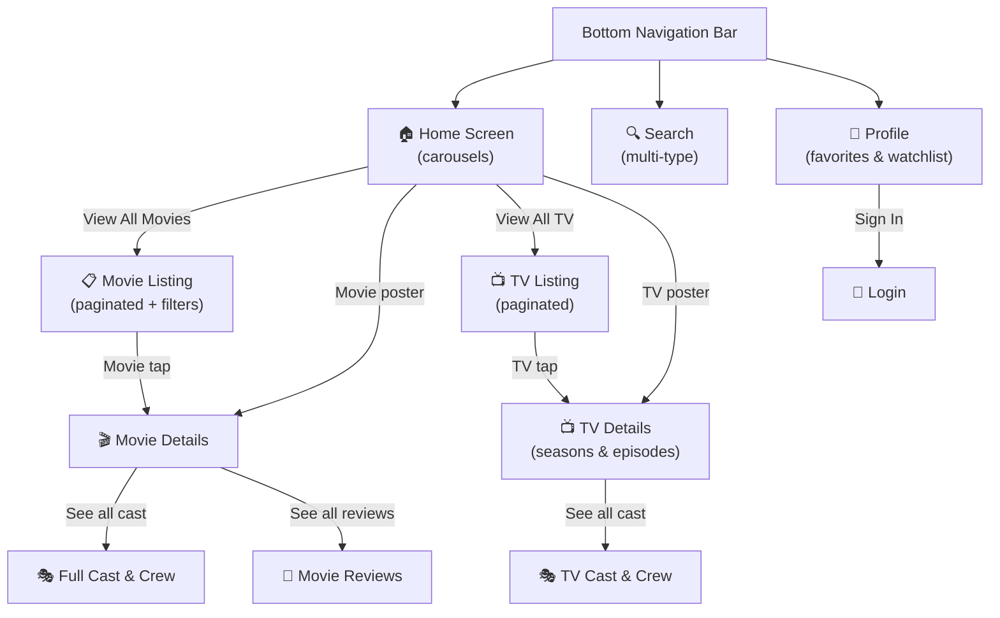
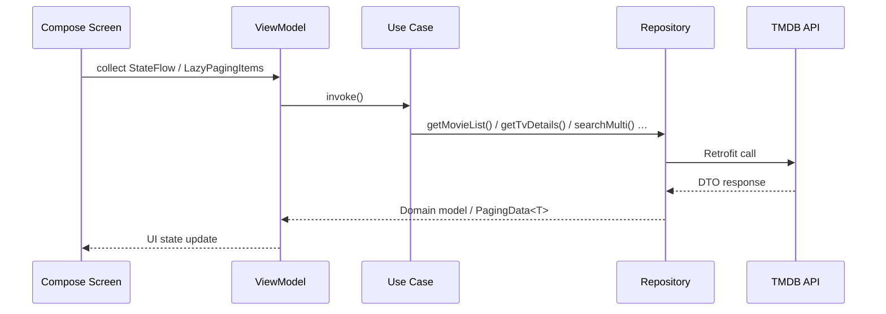

# 🎬 TMDB Android App [version 1]
### Jetpack Compose · Clean Architecture · Dark Theme

A modern Android application for browsing movies and TV shows using the **TMDB API** — featuring home carousels, paginated lists with filtering & sorting, detailed info, cast & crew, reviews, multi-type search, and optional TMDB account login with favorites and watchlist.

---

## ✨ Features

- **Home screen** — six alternating carousels (Popular Movies, Popular TV, Now Playing, On The Air, Upcoming, Top Rated TV) loading in parallel, with a collapsible TopAppBar on scroll
- **Movie Listing** — paginated list for any TMDB list type; filter by genre, minimum rating, and release year; sort by popularity, rating, release date, or vote count
- **Movie Details** — backdrop, genres, runtime, tagline, overview, rating, and a latest review preview
- **Full Cast & Crew** — complete credits with profile images
- **Movie Reviews** — paginated review list with author avatars and ratings
- **TV Series** — listing, details (seasons & episodes count, genres, tagline), and full cast & crew
- **Season & Episodes** — season selector on TV details; expandable episode list with load-more pagination
- **Search** — debounced multi-type search across movies, TV shows, and people; media-type chip on each result
- **Account Login** — optional TMDB account sign-in; Favorites and Watchlist tabs on the Profile screen
- **Bottom navigation** — Home / Search / Profile tabs; auto-hidden on detail screens
- **Netflix-inspired dark theme** — permanent dark colour scheme with Netflix Red accents and a bold type scale

---

## 🧱 Tech Stack

| Layer            | Libraries                                        |
|------------------|--------------------------------------------------|
| **UI**           | Jetpack Compose, Material 3, Coil                |
| **Navigation**   | Navigation Compose                               |
| **Architecture** | Clean Architecture + MVVM                        |
| **DI**           | Hilt                                             |
| **Networking**   | Retrofit 3, OkHttp, Gson                         |
| **Async**        | Kotlin Coroutines + Flow                         |
| **Pagination**   | Paging 3                                         |
| **Local Storage**| SharedPreferences (session persistence)          |
| **Language**     | Kotlin 2.3                                       |

---

## 📐 Architecture

```
Presentation  →  Domain  ←  Data
```

- **Presentation** — Compose screens + `@HiltViewModel` ViewModels. Non-paginated screens expose `data class` UI state (isLoading / error / data) via `StateFlow`; paginated screens collect `PagingData` directly with `collectAsLazyPagingItems()`.
- **Domain** — Use cases (invoked via `operator fun invoke()`), repository interfaces, domain models, and a `Result<T>` / `safeCall {}` utility.
- **Data** — Five repository implementations (`Movie`, `Tv`, `Search`, `Auth`, `Account`) backed by Retrofit. DTOs are mapped to domain models in `*Mapper.kt` files. Pagination is handled by five `PagingSource` classes. `SessionManager` persists the TMDB session in `SharedPreferences`.

### Filter → Endpoint routing

`MovieListPagingSource` automatically routes to the `discover/movie` endpoint whenever `MovieFilterState.needsDiscoverApi` is true (any genre, rating, year filter, or explicit sort is active). Otherwise it calls the natural list endpoint (`movie/popular`, `movie/now_playing`, etc.).

---

## 🧭 Navigation


```mermaid
flowchart TD
    Home["🏠 Home Screen\n(carousels)"]
    Listing["📋 Movie Listing\n(paginated + filters)"]
    Details["🎬 Movie Details"]
    Cast["🎭 Full Cast & Crew"]
    Reviews["💬 Movie Reviews"]
    TvListing["📺 TV Listing\n(paginated)"]
    TvDetails["📺 TV Details\n(seasons & episodes)"]
    TvCast["🎭 TV Cast & Crew"]
    Search["🔍 Search\n(multi-type)"]
    Profile["👤 Profile\n(favorites & watchlist)"]
    Login["🔑 Login"]

    Home -->|View All Movies| Listing
    Home -->|Movie poster| Details
    Home -->|View All TV| TvListing
    Home -->|TV poster| TvDetails
    Listing -->|Movie tap| Details
    Details -->|See all cast| Cast
    Details -->|See all reviews| Reviews
    TvListing -->|TV tap| TvDetails
    TvDetails -->|See all cast| TvCast
    Profile -->|Sign In| Login

    BottomNav["Bottom Navigation Bar"]
    BottomNav --> Home
    BottomNav --> Search
    BottomNav --> Profile
```

> The bottom navigation bar is **only visible** on the three top-level routes (Home, Search, Profile) and hides automatically on all detail screens.

---

## 🔐 Auth Flow

Login uses the TMDB v3 session API — no OAuth redirect needed:

```
1. GET  authentication/token/new           → request_token
2. POST authentication/token/validate_with_login (username + password + token)
3. POST authentication/session/new (token) → session_id  (stored locally)
4. GET  account?session_id                 → account_id  (stored locally)
```

Session persists across app restarts. Sign Out deletes the session on TMDB and clears local storage.

---

## 🔄 Data Flow


```mermaid
sequenceDiagram
    participant UI as Compose Screen
    participant VM as ViewModel
    participant UC as Use Case
    participant Repo as Repository
    participant API as TMDB API

    UI->>VM: collect StateFlow / LazyPagingItems
    VM->>UC: invoke()
    UC->>Repo: getMovieList() / getTvDetails() / searchMulti() …
    Repo->>API: Retrofit call
    API-->>Repo: DTO response
    Repo-->>VM: Domain model / PagingData<T>
    VM-->>UI: UI state update
```

---

## 🚀 Getting Started

1. Clone the repository.
2. Get a free API **Read Access Token** from [themoviedb.org](https://www.themoviedb.org/settings/api).
3. Add it to `local.properties` (create the file if it doesn't exist):
   ```
   TMDB_API_TOKEN=your_read_access_token_here
   ```
4. Build and run:
   ```bash
   ./gradlew installDebug
   ```

---

## 📄 License

This project is for educational purposes.
